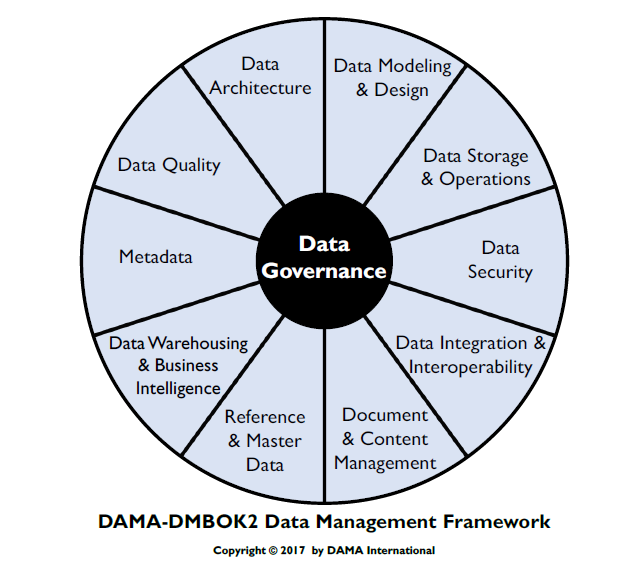
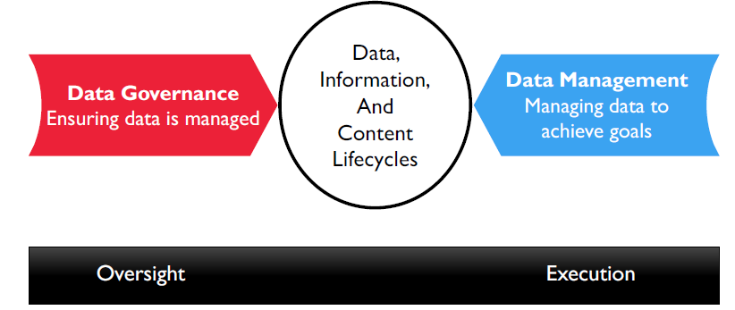
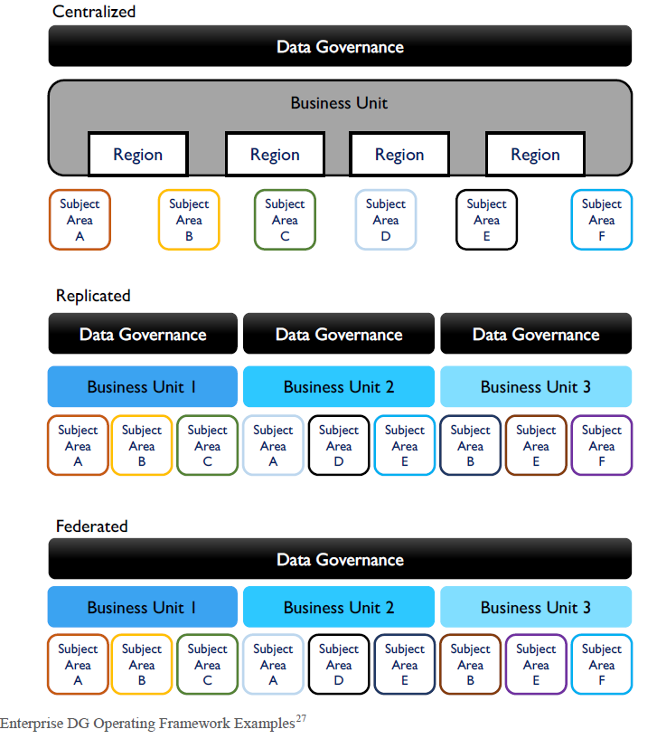

## **Introduction to Data Governance**
Data Governance (DG) is defined as the exercise of authority and control (planning, monitoring, and enforcement) over the management of data assets. In another word, Data governance refers to managing the availability, usability, integrity, and security of data in an organization. It ensures data is treated responsibly and meets compliance standards.
## **Why is Data Governance Important?**
  - Ensures data accuracy for decision-making.
  - Protects sensitive data (e.g., PII, financial data).
  - Mitigates risks related to regulatory non-compliance.
  - Real-world Examples: GDPR fines for data breaches, Organizations losing customer trust due to poor data practices.
## **Key Components of Data Governance**
The **DAMA-DMBOK2 Data Management Framework** is a comprehensive guide to understanding and implementing effective data governance in an organization. It emphasizes the core role of data governance and outlines interconnected data management disciplines.

1. **Data Architecture**: Focuses on the structure of data systems. (e.g., Designing a database schema that separates customer, product, and order data for efficient organization.)

2. **Data Modeling & Design**: Designs data models for business requirements. (e.g., Creating an ER diagram to represent relationships between patients, appointments, and medical records.)

3. **Data Storage & Operations**: Handles efficient storage and access. (e.g., Using cloud storage like AWS S3 to store and retrieve large video files for streaming services.)

4. **Data Security**: Ensures data protection. (e.g., Encrypting customer passwords using a hashing algorithm before storing them in a database.)

5. **Data Integration & Interoperability**: Facilitates data sharing across systems. (e.g., Merging flight schedules from multiple airlines into a unified portal for customer searches.)

6. **Document & Content Management**: Manages unstructured data.(e.g., Organizing legal contracts and case files in a document management system for quick retrieval.)

7. **Reference & Master Data**: Maintains consistent critical data. (e.g., Keeping a master list of country codes and currencies for a global e-commerce platform.)

8. **Data Warehousing & Business Intelligence**: Supports analytics and insights. (e.g.,Building a data warehouse to analyze sales trends and visualize them in Tableau.)

9. **Metadata**: Describes and provides context for data. (e.g., Adding metadata to a video file, such as title, duration, and resolution, for better indexing.)

10. **Data Quality**: Ensures high standards for data reliability. (e.g.,Validating email formats in a customer database to ensure accurate contact information.)

This framework is instrumental for organizations aiming to treat data as a strategic asset.

## **Key Distinction**
- **Data Governance**: Focuses on oversight, ensuring that data is managed according to policies, standards, and regulations.  
  *Example*: Establishing rules for data access and security compliance.
  
- **Data Management**: Emphasizes execution, applying the rules and policies to achieve operational goals.  
  *Example*: Implementing a secure database system and managing user access.
  

---

## **Data Governance and Stewardship**
  - Data Governance is the exercise of authority, control, and shared decision-making for managing data assets.
  - Stewardship ensures the proper implementation and execution of governance policies. (Data Stewardship is the most common label to describe accountability and responsibility for data and processes that ensure effective control and use of data assets.)

### **Key Goals**
   1. Enable organizations to manage data as a strategic asset.
   2. Define and implement principles, policies, and tools for data management.
   3. Monitor compliance, ensure data quality, and guide data usage.

---

## **Key Principles of Data Governance**

### **1. Sustainability**
- **Ongoing Process**: Data Governance is not a one-time project but a continuous journey.
- Key Benefits:
  - Ensures consistent improvements in data quality, security, and accessibility.
  - Establishes a long-term vision for managing data.
- Organizational Requirements:
  - Budget Allocation: Adequate funding for tools and processes.
  - Dedicated Teams: Specialists for governance activities, such as data stewards and analysts.

### **2. Embeddedness**
- **Integration into Workflows**:
  - **Software Development Life Cycle (SDLC)**: Embed governance checkpoints during development phases.
  - **Data Pipelines**: Implement quality checks and enforce policies at every stage of the data lifecycle.
- Cross-Functional Collaboration: Collaboration between IT, business units, and compliance teams ensures effective policy implementation and monitoring.

### **3. Leadership**
- **Executive Sponsorship**:
  - Successful DG initiatives require support from senior executives, such as:
    - **Chief Data Officer (CDO)**
    - **Chief Risk Officer (CRO)**
    - **Chief Information Officer (CIO)**
- Leadership ensures DG goals are aligned with the organization's broader business strategy.

### **4. Business-Driven**
- **Tangible Business Benefits**:
  - Improved decision-making through accurate and accessible data.
  - Reduced operational risks.
  - Compliance with industry regulations (e.g., GDPR, HIPAA, SOX).
- Focus Areas: Ensure DG initiatives provide measurable value to the organization.

---

## **Data Governance in Action**

### **Real-World Applications**
1. **Healthcare**:
   - Ensure patient data privacy and compliance with **HIPAA** regulations.
   - Create a unified patient data platform for analytics and reporting.
2. **Finance**:
   - Regulatory reporting for **Basel II** or **BCBS 239** compliance.
   - Manage risks associated with credit card data through **PCI-DSS** compliance.
3. **Retail**:
   - Enhance customer segmentation for better marketing strategies.
   - Securely manage customer loyalty program data.

---

### **Example Use Case**
A retail company implemented Data Governance to improve customer data quality:
- Actions Taken:
  - Introduced data quality rules for customer information.
  - Integrated metadata management across the organization.
- Results:
  - Increased customer retention rates by **15%**.
  - Enhanced targeted marketing and overall customer experience.

---
# Challenges in Data Governance: Local and Global Contexts

Data governance (DG) plays a critical role in managing, securing, and utilizing organizational data. However, its implementation is not without challenges, especially when dealing with both local and global regulatory environments. 

---

### **1.1 Fragmented Data Policies**
- **Problem**:
  - Within a single country, data policies often vary between regions, departments, or industries.
  - Leads to inconsistencies in how data is managed, stored, and protected.
  - Example: In the United States, privacy regulations differ across states:
    - **California Consumer Privacy Act (CCPA)** in California mandates stricter privacy standards.
    - Other states may lack similar comprehensive data protection laws.
- Impact: Organizations operating in multiple states face difficulties in standardizing their data practices.

### **1.2 Limited Budget and Resources**
- **Problem**:
  - Smaller organizations or startups often lack the financial resources to implement robust DG programs.
  - Difficulty in hiring skilled professionals, such as Data Stewards, Analysts, or Privacy Officers.
  - Example: A small retail company may not afford advanced data governance tools or training for employees.
- Impact: Increases the risk of data breaches, poor-quality data, and non-compliance with regulations.

### **1.3 Cultural Resistance**
- **Problem**:
  - Employees may not fully understand the importance of DG.
  - Resistance to adopting new workflows, responsibilities, or technologies.
  - **Example**: A marketing team resisting the enforcement of stricter data-sharing rules because it slows down campaign rollouts.
- Impact: Creates roadblocks in the adoption of governance practices and undermines overall organizational efficiency.
- Solution: Conduct awareness programs and training to highlight the benefits of DG for employees and the organization.

---

## **2. Challenges in the Global Context**

### **2.1 Regulatory Complexity**
- **Problem**: Organizations operating globally must comply with multiple and sometimes conflicting regulations.
- **Key Regulations**:
  - **GDPR (Europe)**: Stringent rules on data protection and privacy.
  - **HIPAA (USA)**: Protects sensitive health information.
  - **CCPA (California)**: Focuses on consumer privacy rights.
  - **PIPEDA (Canada)**: Covers personal information used in commercial activities.
- Example: A multinational healthcare company managing patient data faces overlapping requirements from **HIPAA** in the USA and **GDPR** in Europe.
- Impact: High compliance costs and the need for specialized legal and technical expertise.

### **2.2 Cross-Border Data Sharing**
- **Problem**: Different countries have conflicting laws regarding data sharing and storage.
- Example: **GDPR** prohibits transferring data of EU citizens outside the EU unless strict conditions are met (e.g., Standard Contractual Clauses).
- Impact: Organizations struggle to facilitate international data transfers while staying compliant.

### **2.3 Data Localization Requirements**
- **Problem**: Some countries require that specific types of data be stored within their borders.
- Examples:
  - **India’s Data Localization Laws**: Mandates that payment-related data be stored locally.
  - **China’s Cybersecurity Law**: Requires certain business data to be stored in China.
- Impact: Increased infrastructure costs as organizations need to set up local data centers.

### **2.4 Data Sovereignty Concerns**
- **Problem**: Organizations face difficulties using cloud services because of concerns over foreign government access to data.
- Example: The **U.S. CLOUD Act** allows U.S. law enforcement to access data stored on U.S.-based servers, even if the data is physically located in another country.
- Impact: Companies hesitate to use global cloud providers due to fears of breaching data sovereignty laws.

---

## **Examples of Challenges in Action**

### **Case Study: Cross-Border Challenges for a Global E-Commerce Company**
- **Scenario**: A global e-commerce platform collects customer data from multiple countries.
- **Challenges**:
  - **Fragmented Policies**: Adapting to different regulations like GDPR (EU), PIPEDA (Canada), and CCPA (California).
  - **Cross-Border Data Transfers**: Unable to transfer EU customer data to non-EU servers due to GDPR restrictions.
- **Solution**: The company implemented region-specific data storage systems and hired a global compliance team to ensure adherence to local regulations.

### **Case Study: Healthcare Compliance**
- **Scenario**: A U.S.-based healthcare company operates in Europe and the USA.
- **Challenges**: Balancing **HIPAA** compliance for U.S. operations with **GDPR** requirements for European operations.
- **Solution**: The company created separate governance frameworks for each region and used encrypted cloud solutions to facilitate secure data sharing.

# Data Governance Operating Model Types and Federated Learning

Data governance involves defining a framework to manage data effectively and ensure it adheres to organizational and regulatory standards. This framework can be implemented through different operating models, including **Centralized**, **Replicated**, and **Federated** approaches.

---

## **1. Data Governance Operating Model Types**

### **1.1 Centralized Model**
In a centralized model, a single data governance organization oversees all activities across regions and subject areas. This ensures consistency in policies, standards, and data management practices.

  - **Advantages**:
    - Consistent data governance policies across the organization.
    - Simplified enforcement of standards and compliance.

  - **Challenges**:
    - Limited flexibility for regional or business-specific needs.
    - Slower response to local issues due to a centralized authority.

  - **Example**: A global healthcare provider ensures that patient data across all its regions is governed by a unified data governance team to meet HIPAA and GDPR requirements.

---

### **1.2 Replicated Model**
In the replicated model, each business unit has its own data governance function. While the operating models and standards are consistent, each unit operates independently.

  - Advantages:
    - Increased autonomy for business units.
    - Tailored data governance for specific regional or business needs.

  - Challenges:
    - Risk of duplicated efforts across units.
    - Difficulty in maintaining consistency in global standards.

  - Example: A multinational retail chain has separate data governance teams for North America, Europe, and Asia-Pacific regions to cater to their unique regulatory and operational needs.

---

### **1.3 Federated Model**
The federated model involves collaboration between a central data governance team and multiple business units. The central team defines overarching policies and standards, while business units maintain some autonomy for their specific needs.

  - Advantages:
    - Balances global consistency with local flexibility.
    - Encourages collaboration and shared responsibility.
    - Reduces duplicated efforts compared to a replicated model.

  - Challenges:
    - Requires strong coordination between the central and regional units.
    - Potential conflicts between central policies and local needs.

  - Example: A global financial institution uses a federated model where the central governance team defines compliance standards for Basel II, while regional teams adapt them to meet local regulatory requirements.

---

## **2. Federated Learning in Data Governance**

Federated learning is an advanced concept within the federated operating model that focuses on decentralized machine learning. It allows models to be trained across multiple devices or servers holding local data, without transferring the data to a central location. This approach is particularly useful for scenarios involving sensitive or geographically distributed data.

### **Problem Addressed**
Organizations often face challenges in aggregating data for training machine learning models due to:
1. **Data Privacy Concerns**: Regulations like GDPR restrict the movement of personal data across borders.
2. **Data Sovereignty**: Some countries mandate that certain data types must be stored locally (e.g., India's financial data localization laws).

Federated learning enables model training while ensuring data remains local, addressing both privacy and sovereignty concerns.

### **Example Use Case**
A multinational hospital chain uses federated learning to train a predictive model for diagnosing diseases. Each hospital retains patient data locally but contributes to training the global model without sharing raw data. This approach:
- Ensures patient privacy (compliant with HIPAA and GDPR).
- Allows the global model to improve with diverse, real-world data.

---

## **3. Comparing the Operating Models**

| **Model**        | **Centralized**                         | **Replicated**                         | **Federated**                          |
|-------------------|-----------------------------------------|-----------------------------------------|-----------------------------------------|
| **Governance**    | Managed by a single team.              | Each unit has its own governance team.  | Shared responsibility between central and regional units. |
| **Consistency**   | High.                                  | Medium (risk of duplication).           | Balanced global consistency and local autonomy. |
| **Flexibility**   | Low.                                   | High.                                   | Medium (flexible with central oversight). |
| **Use Case**      | Global healthcare compliance.          | Multinational retail operations.        | Financial institution meeting global and local regulations. |

---

## **4. Benefits and Challenges of Federated Learning**

### **Benefits**
- **Data Privacy**: Eliminates the need to transfer sensitive data.
- **Regulatory Compliance**: Adheres to data sovereignty and localization laws.
- **Efficient Collaboration**: Allows multiple parties to contribute to a single model without exposing their data.

### **Challenges**
- **Model Coordination**: Synchronizing model updates from multiple locations is complex.
- **Resource Intensive**: Requires significant computational resources at each location.
- **Data Quality**: Local data variations can impact the overall model's performance.

---
