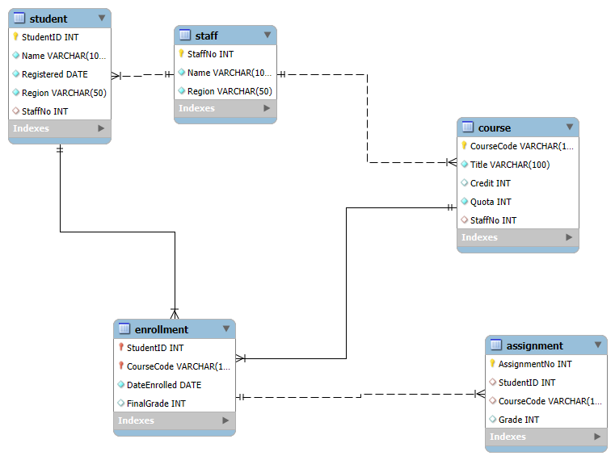
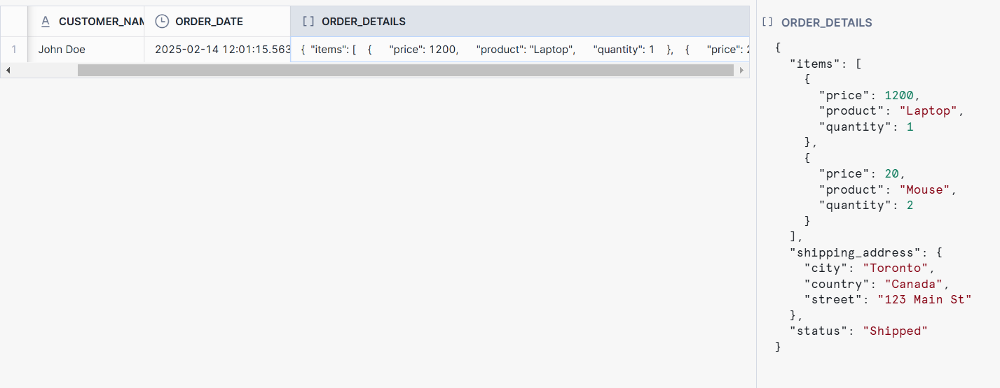
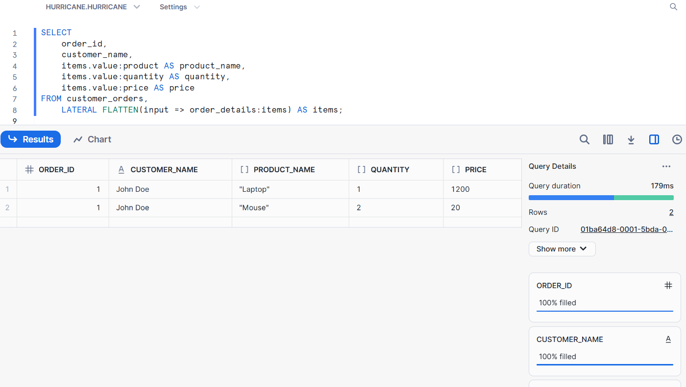

# 📚 Student Enrollment Database - MySQL Implementation

This project implements a **Student Enrollment System** using **MySQL**, designed to introduce relational database concepts in a simple, step-by-step approach.

---

## 📌 **Database Creation and Design**
### **Why This Database?**
A **Student Enrollment System** helps manage students, courses, enrollments, and assignments efficiently. The database ensures:
- **Data Integrity** using primary and foreign keys.
- **Consistency** in enrollments and assignments.
- **Ease of Querying** for reporting and analysis.

### **Key Concepts**
- **Primary Key (PK):** Ensures each record is unique.
- **Foreign Key (FK):** Links tables together, enforcing relationships.
- **Constraints:** Maintain valid data entries (e.g., Grade between 0-100).
- **Normalization:** Avoids redundancy and maintains efficiency.

---

## 📌 **Entity Diagram**
Below is the **Entity Diagram** representing the core tables in the database:


[Source](https://opentextbc.ca/dbdesign01/back-matter/appendix-a-university-registration-data-model-example/)
---

## 🛠 **Entity-Relationship Diagram (ERD)**
Below is the **ERD diagram** representing the database schema:




---

## 🔗 **Creating the Database and Tables**

### **Step 1: Create the Database**
```sql
CREATE DATABASE StudentEnrollmentDB;
USE StudentEnrollmentDB;
```

### **Step 2: Create Tables**

#### **1️⃣ Staff Table**
```sql
CREATE TABLE Staff (
    StaffNo INT PRIMARY KEY AUTO_INCREMENT,
    Name VARCHAR(100) NOT NULL,
    Region VARCHAR(50) NOT NULL
);
```
**Explanation:**
- `StaffNo` is the **Primary Key**.
- `Region` ensures that staff members are assigned to a specific area.


#### **2️⃣ Student Table**
```sql
CREATE TABLE Student (
    StudentID INT PRIMARY KEY AUTO_INCREMENT,
    Name VARCHAR(100) NOT NULL,
    Registered DATE NOT NULL,
    Region VARCHAR(50) NOT NULL,
    StaffNo INT,
    FOREIGN KEY (StaffNo) REFERENCES Staff(StaffNo) ON DELETE SET NULL
);
```
**Explanation:**
- `StudentID` is the **Primary Key**.
- `StaffNo` is a **Foreign Key** linking students to a **Staff member (advisor)**.
- `ON DELETE SET NULL` allows students to exist even if their assigned staff leaves.


#### **3️⃣ Course Table**
```sql
CREATE TABLE Course (
    CourseCode VARCHAR(10) PRIMARY KEY,
    Title VARCHAR(100) NOT NULL,
    Credit INT CHECK (Credit IN (15, 30)), 
    Quota INT NOT NULL,
    StaffNo INT,
    FOREIGN KEY (StaffNo) REFERENCES Staff(StaffNo) ON DELETE SET NULL
);
```
**Explanation:**
- `CourseCode` is the **Primary Key**.
- `Credit` is restricted to **15 or 30** using `CHECK`.
- `StaffNo` links a course to an instructor.


#### **4️⃣ Enrollment Table**
```sql
CREATE TABLE Enrollment (
    StudentID INT,
    CourseCode VARCHAR(10),
    DateEnrolled DATE NOT NULL,
    FinalGrade INT CHECK (FinalGrade BETWEEN 0 AND 100),
    PRIMARY KEY (StudentID, CourseCode),
    FOREIGN KEY (StudentID) REFERENCES Student(StudentID) ON DELETE CASCADE,
    FOREIGN KEY (CourseCode) REFERENCES Course(CourseCode) ON DELETE CASCADE
);
```
**Explanation:**
- Composite **Primary Key (StudentID, CourseCode)** ensures a student can enroll in a course only once.
- `FinalGrade` must be between **0-100**.
- `ON DELETE CASCADE` removes enrollments if a student or course is deleted.


#### **5️⃣ Assignment Table**
```sql
CREATE TABLE Assignment (
    AssignmentNo INT AUTO_INCREMENT PRIMARY KEY,
    StudentID INT,
    CourseCode VARCHAR(10),
    Grade INT CHECK (Grade BETWEEN 0 AND 100),
    FOREIGN KEY (StudentID, CourseCode) REFERENCES Enrollment(StudentID, CourseCode) ON DELETE CASCADE
);
```
**Explanation:**
- **Composite Primary Key (StudentID, CourseCode, AssignmentNo)** ensures uniqueness.
- `Grade` must be between **0-100**.
- `ON DELETE CASCADE` removes assignments if the related enrollment is deleted.


---

## 🔢 **Insert Sample Data**
### **Step 3: Add Sample Data**

#### **👨‍🏫 Staff Data**
```sql
INSERT INTO Staff (Name, Region) VALUES 
('Dr. Smith', 'North'),
('Prof. Johnson', 'South');
```

#### **👨‍🎓 Student Data**
```sql
INSERT INTO Student (Name, Registered, Region, StaffNo) VALUES 
('Alice Brown', '2024-01-10', 'North', 1),
('Bob White', '2024-01-15', 'South', 2);
```

#### **📚 Course Data**
```sql
INSERT INTO Course (CourseCode, Title, Credit, Quota, StaffNo) VALUES 
('CS101', 'Intro to Programming', 15, 50, 1),
('CS102', 'Software Engineering', 30, 40, 2);
```

#### **📝 Enrollment Data**
```sql
INSERT INTO Enrollment (StudentID, CourseCode, DateEnrolled, FinalGrade) VALUES 
(1, 'CS101', '2024-02-01', 85),
(2, 'CS102', '2024-02-02', 78);
```

#### **📝 Assignment Data**
```sql
INSERT INTO Assignment (StudentID, CourseCode, Grade) VALUES 
(1, 'CS101', 90),
(2, 'CS102', 75);
```

---

## 🔎 **Query Examples**
### **1️⃣ Get All Students and Their Enrolled Courses**
```sql
SELECT s.StudentID, s.Name, e.CourseCode, c.Title, e.FinalGrade
FROM Student s
JOIN Enrollment e ON s.StudentID = e.StudentID
JOIN Course c ON e.CourseCode = c.CourseCode;
```

### **2️⃣ Find Assignments of a Specific Student**
```sql
SELECT a.StudentID, s.Name, a.CourseCode, a.AssignmentNo, a.Grade
FROM Assignment a
JOIN Student s ON a.StudentID = s.StudentID
WHERE s.Name = 'Alice Brown';
```

---

## 🔮 **Conclusion**
- **Students will learn step by step**, from creating tables to inserting and querying data.
- **Primary & Foreign Keys** enforce integrity and relationships.
- **Constraints** maintain valid data.
- The **Entity Diagram and ERD diagrams** visually represent relationships, cardinality, and constraints.

---
# Unstructured Data
Snowflake provides the VARIANT data type, which can store semi-structured data like JSON.

```sql
CREATE TABLE customer_orders (
    order_id INT PRIMARY KEY,
    customer_name STRING,
    order_date TIMESTAMP,
    order_details VARIANT -- Semi-structured column
);


```
- You can insert JSON data directly into the VARIANT column.
- Snowflake only allows PARSE_JSON inside a SELECT statement, not VALUES.


```sql
INSERT INTO customer_orders (order_id, customer_name, order_date, order_details)
SELECT 
    1, 
    'John Doe', 
    CURRENT_TIMESTAMP, 
    PARSE_JSON('{
        "items": [
            {"product": "Laptop", "quantity": 1, "price": 1200},
            {"product": "Mouse", "quantity": 2, "price": 20}
        ],
        "shipping_address": {
            "street": "123 Main St",
            "city": "Toronto",
            "country": "Canada"
        },
        "status": "Shipped"
    }');

```

### Check data
```sql
SELECT * FROM customer_orders;

```

 

####  Flatten Nested JSON Arrays (LATERAL FLATTEN)
If you want to list all items inside the items array, use FLATTEN():
```sql
SELECT 
    order_id,
    customer_name,
    items.value:product AS product_name,
    items.value:quantity AS quantity,
    items.value:price AS price
FROM customer_orders, 
    LATERAL FLATTEN(input => order_details:items) AS items;


```
 
