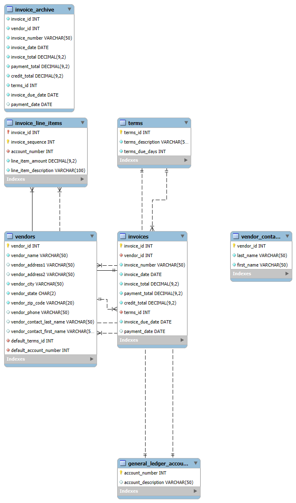

# SQL Tutorial: Understanding Queries, Databases, and Their Use

## Introduction
This document provides a step-by-step tutorial on SQL queries from the **Single Table Activities** document. It also explains the databases being used, their purpose, and the SQL commands required to interact with them effectively.

## **Databases Used**
The provided SQL script creates multiple databases: `AP`, `EX`, and `OM`. These databases are designed for different functionalities:

1. **AP (Accounts Payable Database)**
   - Stores data related to vendor payments, invoices, and financial records.
   - Contains tables like `Vendors`, `Invoices`, `Payments`, etc.
   
2. **EX (Example Database)**
   - A sample database containing tables to demonstrate SQL queries and operations.
   - Includes test data for practicing different SQL commands.
   
3. **OM (Order Management Database)**
   - Used to track orders, customers, and inventory.
   - Contains tables like `Orders`, `Customers`, and `Products`.
  
## **Case Study for AP (Accounts Payable) Database**

### **Business Problem**
Organizations that deal with multiple vendors need a systematic approach to track:
- Vendor details
- Invoice management
- Payments processing
- Outstanding balances
- Financial reporting

A well-structured **AP database** helps streamline financial operations and reduce errors in transactions.

### **Objectives of AP Database**
- **Vendor Management**: Store and retrieve vendor details.
- **Invoice Processing**: Track invoices issued by vendors.
- **Payment Tracking**: Monitor payments made for invoices.
- **Balance Calculation**: Identify pending invoices to avoid late payments.
- **Historical Records**: Store past transactions for financial auditing.

## **Workflow Example**

### **Scenario: A Vendor Issues an Invoice**
1. **Vendor Data is Entered**:
   - A vendor (`vendor_id = 101`) is registered in the `Vendors` table.
   
2. **Invoice Creation**:
   - A new invoice (`invoice_id = 5001`) is added to the `Invoices` table, linked to `vendor_id = 101`.

3. **Invoice Line Items**:
   - Multiple entries are created in `Invoice_Line_Items` to detail the purchased goods/services.

4. **Payments Recorded**:
   - Payments made for `invoice_id = 5001` are added to the `Payments` table.
   - If the invoice is partially paid, the balance remains in `Invoices.invoice_total`.

---

   
Each of these databases is structured using SQL **Data Definition Language (DDL)** statements such as `CREATE DATABASE`, `CREATE TABLE`, and `INSERT INTO` to populate the tables.

## **Setting Up the Databases in MySQL Workbench**
To set up the databases, follow these steps:
1. Open **MySQL Workbench**.
2. Connect to the database server.
3. Click **File > Open SQL Script** and select the `.sql` script.
4. Click **Execute** to run the script.
5. Verify the databases and tables using:
   ```sql
   SHOW DATABASES;
   USE database_name;
   SHOW TABLES;
   ```
   



## **Entity-Relationship Schema of AP Database**
The `AP` (Accounts Payable) database consists of several interconnected tables:

### **Entities and Their Relationships**
- **Vendors** (`vendor_id` as PK) → Stores details about suppliers.
- **Invoices** (`invoice_id` as PK) → References `vendor_id` as a foreign key.
- **Payments** (`payment_id` as PK) → References `invoice_id` to track payments made.
- **Invoice_Line_Items** (`line_item_id` as PK) → References `invoice_id` to store line-wise breakdowns.

### **Relationships Between Tables**
- `Vendors (1) → (M) Invoices` (One vendor can have multiple invoices)
- `Invoices (1) → (M) Invoice_Line_Items` (One invoice can have multiple line items)
- `Invoices (1) → (M) Payments` (One invoice can have multiple payments)
   

## **Problem 1: Retrieving Vendor Details**
### **Query:**
```sql
SELECT vendor_name, vendor_contact_last_name, vendor_contact_first_name
FROM Vendors
ORDER BY vendor_contact_last_name ASC, vendor_contact_first_name ASC;
```
### **Explanation:**
- **`SELECT`**: Retrieves specific columns from a table.
- **`FROM Vendors`**: Specifies the table to pull data from.
- **`ORDER BY`**: Sorts results by `vendor_contact_last_name`, then by `vendor_contact_first_name` in ascending order.
- **Use Case**: Useful for organizing vendor details in a readable format.

---

## **Problem 2: Concatenating Names and Filtering Data**
### **Query:**
```sql
SELECT CONCAT(vendor_contact_last_name, ', ', vendor_contact_first_name) AS full_name
FROM Vendors
WHERE vendor_contact_last_name LIKE 'A%' OR vendor_contact_last_name LIKE 'B%' OR vendor_contact_last_name LIKE 'C%' OR vendor_contact_last_name LIKE 'E%'
ORDER BY vendor_contact_last_name, vendor_contact_first_name;
```
### **Explanation:**
- **`CONCAT()`**: Joins last and first name with a comma and space.
- **`AS full_name`**: Renames the output column.
- **`WHERE`**: Filters records where last names start with A, B, C, or E.
- **`LIKE 'A%'`**: Matches names beginning with 'A'.
- **Use Case**: Helps in generating formatted contact lists based on criteria.

---

## **Problem 3: Invoice Calculations**
### **Query:**
```sql
SELECT invoice_due_date AS "Due Date", invoice_total AS "Invoice Total", 
       invoice_total * 0.1 AS "10%", 
       invoice_total + (invoice_total * 0.1) AS "Plus 10%"
FROM Invoices
WHERE invoice_total BETWEEN 500 AND 1000
ORDER BY invoice_due_date DESC;
```
### **Explanation:**
- **`invoice_total * 0.1`**: Calculates 10% of the invoice total.
- **`invoice_total + (invoice_total * 0.1)`**: Adds 10% to total.
- **`BETWEEN 500 AND 1000`**: Filters invoices within the range.
- **Use Case**: Helpful for financial analysis on specific invoice amounts.

---

## **Problem 4: Calculating Balances**
### **Query:**
```sql
SELECT invoice_number, invoice_total, 
       (payment_total + credit_total) AS payment_credit_total, 
       (invoice_total - (payment_total + credit_total)) AS balance_due
FROM Invoices
WHERE (invoice_total - (payment_total + credit_total)) > 50
ORDER BY balance_due DESC
LIMIT 5;
```
### **Explanation:**
- **`(payment_total + credit_total)`**: Computes total payments and credits.
- **`invoice_total - (payment_total + credit_total)`**: Calculates balance due.
- **`LIMIT 5`**: Returns only the top 5 results with the highest balance due.
- **Use Case**: Useful for identifying top outstanding invoices.

---

## **Problem 5: Unpaid Invoices**
### **Query:**
```sql
SELECT invoice_number, invoice_date, 
       (invoice_total - payment_total - credit_total) AS balance_due, 
       payment_date
FROM Invoices
WHERE payment_date IS NULL;
```
### **Explanation:**
- **`payment_date IS NULL`**: Filters unpaid invoices.
- **Use Case**: Helps in identifying overdue invoices.

---

## **Problem 6: Display Current Date**
### **Query:**
```sql
SELECT DATE_FORMAT(CURRENT_DATE, '%m-%d-%Y') AS "current_date";
```
### **Explanation:**
- **`CURRENT_DATE`**: Retrieves today's date.
- **`DATE_FORMAT()`**: Formats the date as `mm-dd-yyyy`.
- **Use Case**: Useful for timestamping reports.

---

## **Problem 7: Interest Calculation**
### **Query:**
```sql
SELECT 50000 AS starting_principal, 
       50000 * 0.065 AS interest, 
       50000 + (50000 * 0.065) AS principal_plus_interest;
```
### **Explanation:**
- **`50000 * 0.065`**: Calculates 6.5% interest.
- **Use Case**: Demonstrates basic financial calculations in SQL.

---

## **Conclusion**
- These queries help in retrieving and manipulating structured data efficiently.
- Understanding SQL functions like `SELECT`, `WHERE`, `ORDER BY`, `CONCAT()`, and arithmetic operations are crucial for database management.

---


